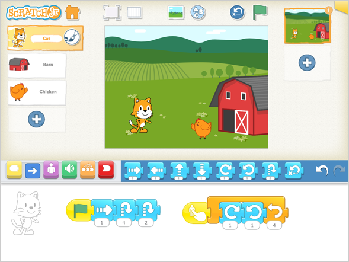
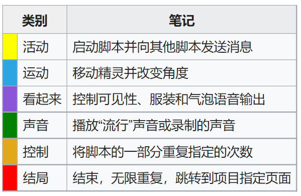
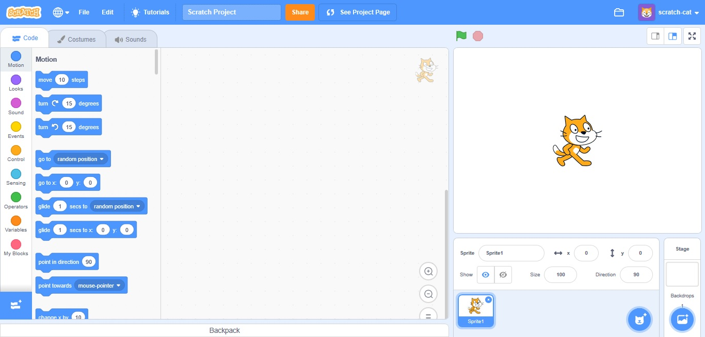
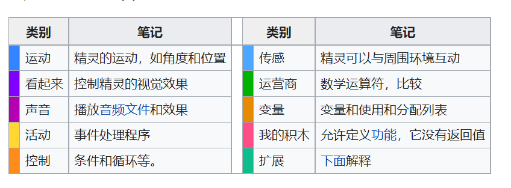

# 关于青少年图形化编程介绍

## ScratchJr

ScratchJr 是一个入门级的编程语言，它可以让幼儿 ( 5-7岁 ) 创建互动的故事和游戏，孩子利用图形化的程序积木让角色移动、跳跃、舞蹈、唱歌。孩子也可以利用绘图编辑器绘制自己的角色、用麦克风录制自己声音、用照相机加入自己拍摄的照片。最后用拼积木的方法组合成程序，让他们心中的角色动起来。

ScratchJr 由麻省理工学院媒体实验室开发，该实验室也与塔夫茨大学和 The Playful 发明公司合作开发了。它可作为适用于 iOS、Android 和 Chromebook 的免费应用程序使用。

孩子们在称为精灵的对象中创建代码 - 可以是角色或其他对象。ScratchJr 带有一个精灵库，可以使用“Paint Editor”编辑精灵或创建新精灵。

代码是通过将块拖动到编码区域并将它们对齐在一起来创建的。所有的积木都是完全基于图标的（没有文字），这就是孩子们在阅读之前可以使用这种语言的方式。块从左到右连接，就像单词一样。

用户界面比 Scratch 简单得多。编程块的类别数量和每个类别内的块数量都减少了，因此只保留了最基本的块。

除了精灵，孩子们还可以为项目添加背景，为他们提供环境和氛围。每个背景都被视为一本书中的一页，并且有自己的一组精灵。一个项目最多可以有 4 个背景。

注：国内有可能无法下载ScratchJr，可以在应用市场下载编程启蒙。

## Scratch

Scratch是麻省理工学院的“终身幼儿园团队”开发的一种图形化编程工具，主要面对全球青少年开放，是图形化编程工具当中最广为人知的一种形式。

Scratch是麻省理工学院开发的一款简易图形化编程工具。这个软件的开发团队称为“终身幼儿园团队”（Lifelong Kindergarten Group）。几乎所有的孩子都会一眼喜欢上这个软件。建立起做编程的欲望。

Scratch 界面分为三个主要部分：舞台区域、块调色板和编码区域，用于将块放置和排列成脚本，这些脚本可以通过按下绿色标志或单击代码本身来运行。用户也可以创建自己的代码块，它们会出现在“我的块”中。

下表显示了编程块的类别：

注：国内有可能无法下载ScratchJr，可以在应用市场下载编程启蒙。

## Blockly

Blockly是一项由谷歌根据 Apache2.0 许可的开放源码专案，在功能/设计上和MIT的儿童编程语言Scratch类似。

Blockly 可以使用浏览器，也可于 Andriod 和 iOS 中运行，但无法获得网页浏览器的全部特性。

Blockly 是使用能在网页上拖拉并相互连接的视觉化方块，使得程序的撰写更加容易，并且可以生成对应的 JavaScript，Python，PHP 或 Dart 等源代码。

下载页面参考：https://developers.google.com/blockly

## MakeCode

Microsoft MakeCode 是一个免费的开源平台，用于创建引人入胜的计算机科学学习体验，支持进入现实世界编程的进程。基于Blockly构建。

支持micro:bit等硬件。

